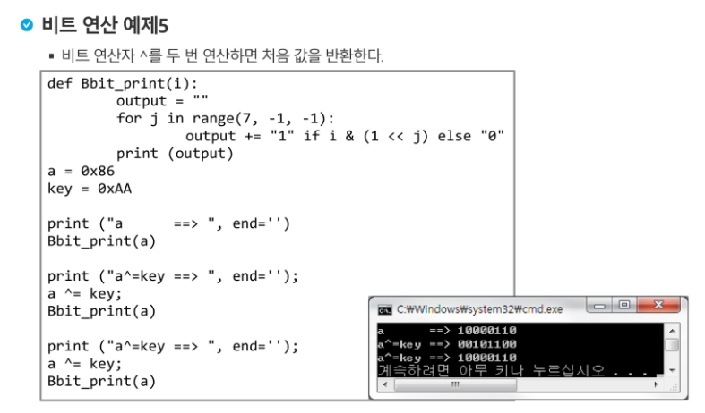
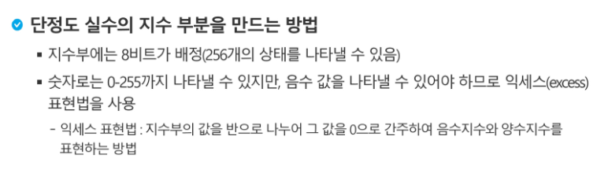

# 1. 비트연산


<br>

## 1-1. 예제 1


<br>

## 1-2. 연습문제 1


<br>

## 1-3. 예제 2


<br>

## 엔디안 (Endianness)


<br>

## 1-4. 예제 3


<br>

## 1-5. 예제 4


<br>

## 1-6. 예제 5 




<br><br>

---

# 2. 진수


## 음수 표현 방법


<br>

if, 4비트

- 맨 앞 1비트-> 부호
- 나머지 3비트-> 이진수 숫자표현 => `2³-1 = 7` -> 범위: `-8 ~ 7`

<br>

**ex.**  00000001 <- `1`

~(1) : 11111110 <- 1의 보수

+1 => 11111111 <- `-1`  (2의 보수) : 현재 비트보다 1자리 많은(i.e. 100000000) 2의 제곱수와의 차이

<br>

**ex.** 1010 -> `-6`

1의 보수 (0,1 반대로) -> 0101

2의 보수 (1의 보수에 +1) -> 0110 => `6`

<br>

## 2-2. 연습문제 2


```
10진수로 변환하려면 2진수로 먼저 변환 후, 10진수로 변환해야함.
0F를 2진수로 바꾸면 00001111 -> 그 다음에 7개씩 끊은 다음 10진수로 변환
```

<br><br>

---

# 3. 실수





<br>

## 3-1. 연습문제 3


<br>

---

<br>

# cf. 복잡도 분석


<br>

## 시간복잡도


<br>


<br>


- 출처 :  https://www.bigocheatsheet.com/

<br>


