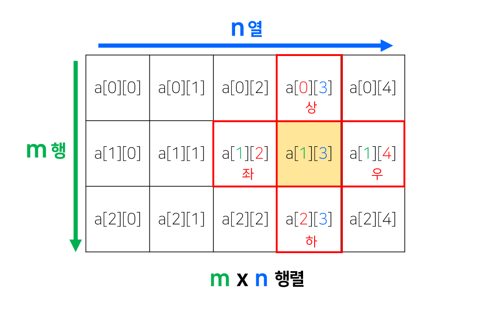
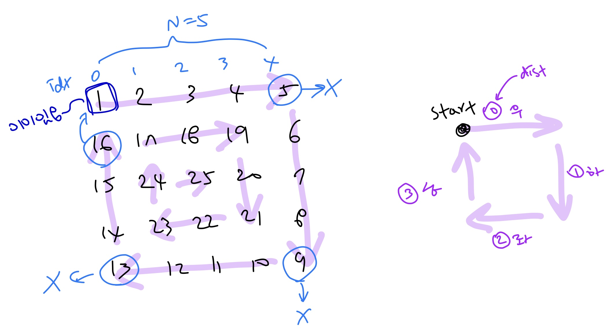

# [swea] 1954. 달팽이 숫자

### Intro

#### 💡   2차원 배열의 인덱스 접근을 어떻게 할것인가?

> 아래 그림처럼 m x n 배열을 생각해보자. 배열의 인덱스는 오른쪽으로 갈 수록, 아래로 갈 수록 증가하기 때문에 다음과 같이 쓸 수 있다.

노랭이를 기준으로 봤을 때, 노랭이의 위 아래는 노랭이와 column 인덱스가 동일하고 row 인덱스는 하나씩 차이난다.

노랭이의 좌우는 노랭이와 row 인덱스가 동일하고 column 인덱스는 하나씩 차이난다.




따라서, 인덱스를 활용해서 방향전환을 하고 싶을때는 delta row(`dr`), delta column(`dc`) 리스트를 만들고 접근하면 된다

```python
# 상, 우, 하, 좌
dr = [-1, 0, 1, 0]
dc = [0, 1, 0, -1]

# cr: current row, cc: current column
for i in range(4):
    cr += dr[i]
    cc += dc[i]
```

<br><br><br>

### thinking

> 아래 그림처럼 N = 5. 즉, 5 x 5 배열을 생각해보자.

달팽이 문제는 위의 인덱스를 활용한 2차원 배열 탐색으로 해결하자고 생각했다.

`우->하->좌->상` 의 방향전환 리스트를 만들어 준 후, 방향 전환이 일어나기 전까지 더하다가

✔ 5, 9, 13 처럼 **더 이상 그 방향으로 진행할 수 없는 경우** (즉, row나 column의 인덱스가 범위 밖인 경우) 와

16 처럼 인덱스의 **범위 안에는 들지만, 더 가려고 해도 이미 숫자가 입력된 상태라 못가는 경우** (즉, 0이 아니라면)라면

**이미 r, c를 업데이트 시켜줬으므로 다시 빼서 원위치 시켜주고 방향 전환 뒤, 다시 진행할 수 있도록 조건문을 설정했다.**

✔  방향 전환 시, `dist += 1` 을 해주면 dist가 0,1,2,3,4,5,6,7,8,9, ... 로 계속 증가한다. 

**0, 1, 2, 3 으로만 움직일 수 있게 `%` 를 사용하자 !**



<br><br><br>

### 코드

> print 할 때, 리스트 앞에 `*` 를 붙이면 `[]` 가 출력되지 않는다.

```python
import sys
sys.stdin = open("input.txt")

T = int(input())

# row, col 인덱스로 탐색할 수 있게 방향 설정 (달팽이 방향이니까 우->하->좌->상)
dr = [0, 1, 0, -1]
dc = [1, 0, -1, 0]

for tc in range(1, T+1):
    N = int(input())
    snail = [[0]*N for _ in range(N)]
    # 초기 위치 & 회전방향 설정
    r, c = 0, 0
    dist = 0  # 0:우, 1:하, 2:좌, 3:상

    for n in range(1, N*N + 1):
        snail[r][c] = n
        r += dr[dist]
        c += dc[dist]

        # 범위를 벗어나거나 0이 아닌 다른 값이 이미 있다면, dist 방향 체인지
        # 근데 이런 경우라면 요소 인덱스를 다시 원위치시켜줘야하므로 빼줘야함
        # 그런다음 dist의 방향을 바꾸고, 방향 바꿨으면 다시 움직일 수 있도록 행렬 인덱스 업데이트
        if r < 0 or c < 0 or r >= N or c >= N or snail[r][c] != 0:
            # 실행취소
            r -= dr[dist]
            c -= dc[dist]
            # dist는 % 4 안해주면 0123, 4567, ... 이런식으로 숫자 커지므로 나머지로 접근
            dist = (dist + 1) % 4
            #  다시 go!
            r += dr[dist]
            c += dc[dist]

    print("#{}".format(tc))
    for row in snail:
        print(*row)
    print()
```

